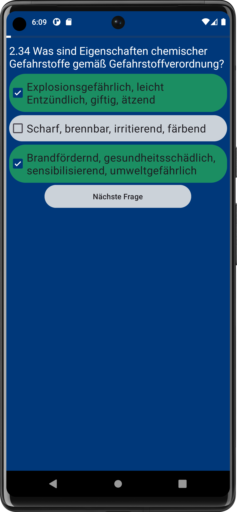

# THW_Theorie
Eine einfache App zum lernen der THW Theorie für die GA (GrundAusbildung). Derzeitiger Fragenkatalog 2022 3.4.

</a>
</a>
</a>
</a>

## Personalisiertes Lernen
Wähle selbst aus was du wie Lernen möchtest.

</a>

## Rechtliches
Ich habe keine Rechte an den verwendeten THW Logos oder den Fragen. Weder hat das THW die Nutzung seines Logos oder des Fragekataloges oder die App in teilen oder als ganzes autorisiert, zugestimmt oder gebiligt. Alle Rechte für THW Logos oder Fragenkataloge liegen beim [THW](https://thw.de)
